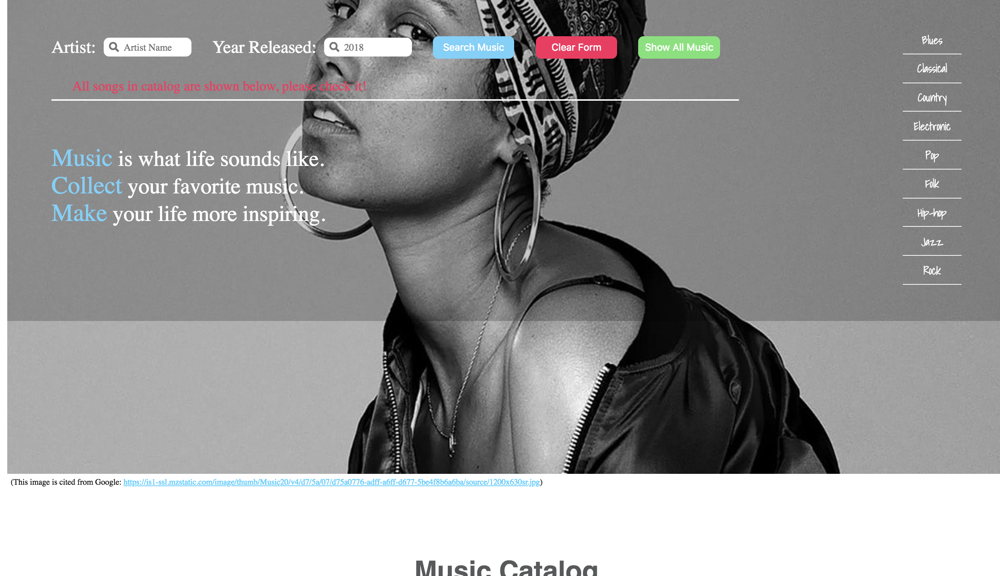
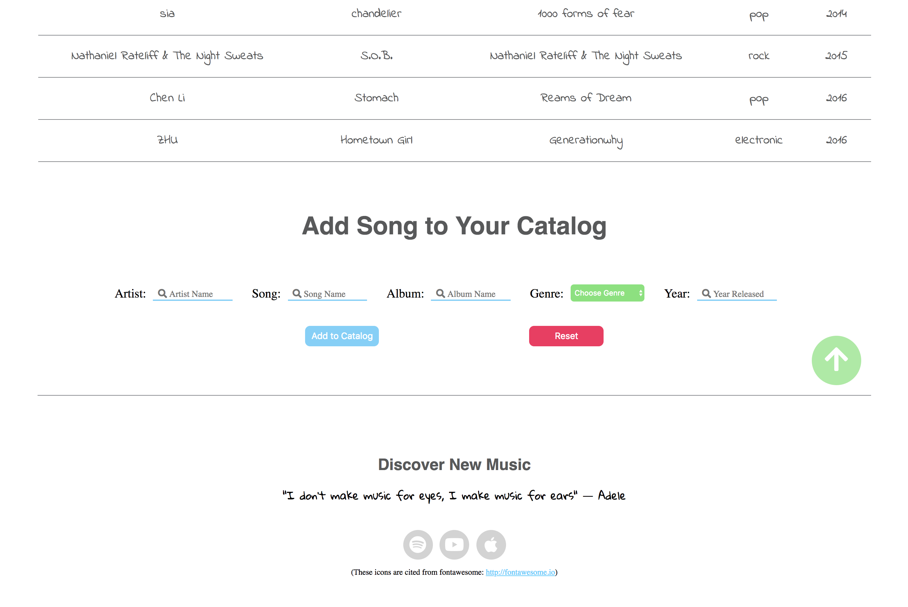

# CS2300-project2
This project is about learning how to use a database to render the contents of a web page. To develop these skills I build a small catalog website. I stored the data for my catalog in a SQLite database. I then write a PHP web page to read the contents of the database and then present the data in a usable form for the web.

 ##  Design and Intro
[Design Plan](design-plan/design-plan.md) 
[Skectch](design-plan/sketch.jpg) 
[Wireframe](design-plan/wireframe.jpg)

 

 

 I designed a catalog to store favorite songs, which will introduce the artist name, song name, album name, genre and year when released.  User can search song in catalog by artist and year or by genre, there will be a select bar on the header that will guide user to search song by genre directly.  There will also has a search form in the header for user to fill in artist and year, user can fill in either one of them to do search by that field or fill both of them to do a combination search.  After searching, the table will only show the specific songs that user search, if user want to check the whole catalog again, they can click green show all music button in the header, which will be convenient for them to check all songs in catalog.
