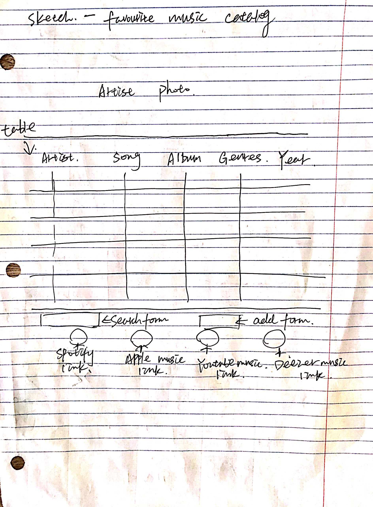
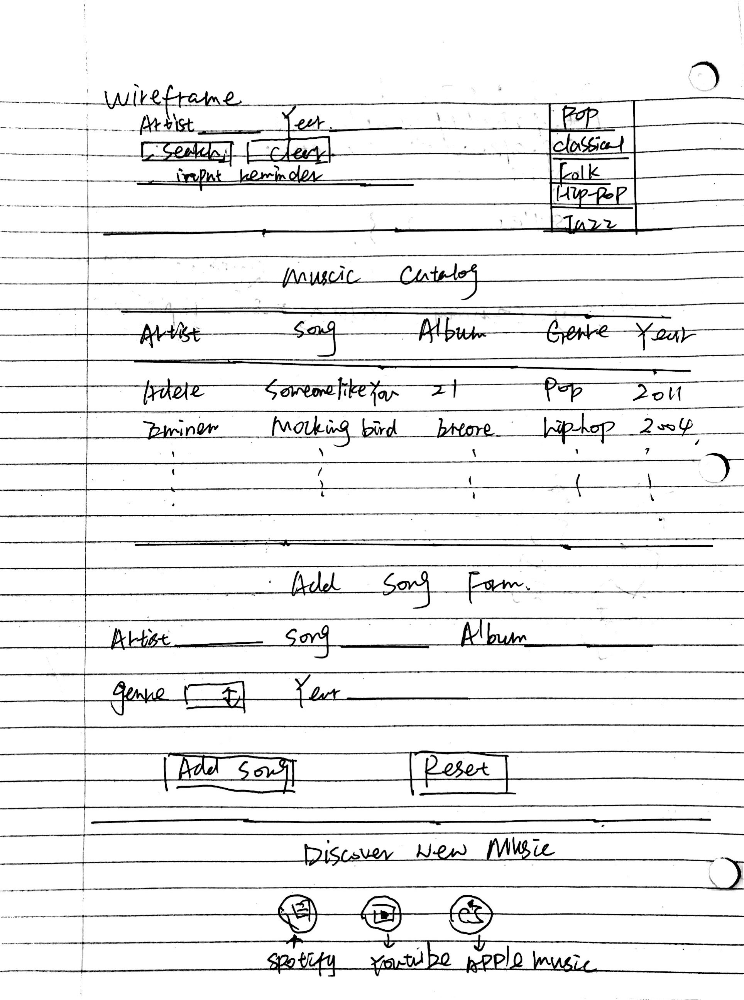

# Project 2, Milestone 1 - Design & Plan

Your Name: Chen Li

## 1. Persona

I've selected Abby as my persona.

I've selected my persona because her personality represents a large number of users, a huge number of users don't have much sapre time to learn new technologies and prefer to use methods that they familiar with.  If I design a catalog that works comfortably for this persona, this catalog will be a good design for both users with low computer self-efficacy and users with high computer self-efficacy.  an easy-to-use website always performs well for all people.

## 2.Describe your Catalog

I will design a catalog to store favorite songs, which will introduce the artist name, song name, album name, genre and year when released.  User can search song in catalog by artist and year or by genre, there will be a select bar on the header that will guide user to search song by genre directly.  There will also has a search form in the header for user to fill in artist and year, user can fill in either one of them to do search by that field or fill both of them to do a combination search.  After searching, the table will only show the specific songs that user search, if user want to check the whole catalog again, they can click green show all music button in the header, which will be convenient for them to check all songs in catalog.
## 3. Sketch & Wireframe





My sketches illustrate that for each song, there will be a comprehensive introduction, this structure will be very simple for a user to browse and get the information they want since the layout of the catalog is succinct and clear.  Users can also search and add information very easily.  To make user search song more easily, I add a side bar on the right side on the header where user can search the genre they are interested in.

## 4. Database Schema Design
One table called music will be implemented to store information, the table will has six fileds:song_id, song_artist, song_name, song_album, song_genre, and song_year.  The details of these fields are described below.

Table: music
* song_id: INTEGER NOT NULL PRIMARY KEY AUTOINCREMENT UNIQUE
* song_artist: TEXT NOT NULL
* song_name: TEXT NOT NULL
* song_album: TEXT NOT NULL
* song_genre: TEXT NOT NULL
* song_year: TEXT NOT NULL

## 5. Database Query Plan


1. All records
```sql
SELECT * FROM music;
```

2. Search records by user selected field
```sql
SELECT * FROM music WHERE song_0artist="";
SELECT * FROM music WHERE song_artist="" and song_year="";
```

3. Insert record
```sql
INSERT INTO music (song_artist,song_name,song_album,song_genre,song_year) VALUES (artist_name_add,song_add,album_add,song_genre,year_released_add)";
```

## 6. *Filter Input, Escape Output* Plan

Filter Input:

PHP filters will be used to validate and sanitize data, I will use sanitize filter to remove special characters in String input, and use validate filter to determine whether the data is valid.  I will use trim() to trip the white space on the two sides of string.  For each field, I also restrict text length in my regular expression, the length of text should not longer than 100.  Because some artists are band names and some others are not the real name but stage name, so I will not choose to assign two fields (first name and last name) for user, but only one field (artist).  For year inputed, I will give a regular expression to filter illegal input and also verify whether the year that user input is later than the current year to make sure that it's not later than the current year.
```
$artist = trim($_POST["artist_name"]);
$song = trim($_POST["song"]);
$album = trim($_POST["album"]);
$year = trim($_POST["year"]);

filter_var($artist, FILTER_VALIDATE_REGEXP, array("options"=>array("regexp"=>"/^[-' $*&a-zA-Z]{1,100}$/")))
filter_var($year, FILTER_VALIDATE_REGEXP, array("options"=>array("regexp"=>"/^\d{4}$/")) and $year_released>2018)
filter_var($album, FILTER_VALIDATE_REGEXP, array("options"=>array("regexp"=>"/^[-' .$*&a-zA-Z\d]{1,100}$/")))
filter_var($song, FILTER_VALIDATE_REGEXP, array("options"=>array("regexp"=>"/^[-' .$*&a-zA-Z\d]{1,100}$/")))
$song_genre = filter_input(INPUT_POST, "song_genre", FILTER_SANITIZE_STRING);


```


* To escape values for SQL, I will use :var syntax. For example, when I search data by name, I will write $sql = "SELECT * FROM alumni WHERE alumni_name = :name; $params = array(':name' => $name)".

* To escape values for HTML, I will use htmlspecialchars() function in my user-defined function so to print escaped data in table.


## 7. Additional Code Planning
For preventing input duplicate entries, I will use a for loop:
```
flag=true;
for($record in $records){
  if($record["song"]==song_name waited for inputting and $record["album"]==song_album){
    break;
    flag=false;
  }
}
if(flag and isset(each attribute)){
  input new data
}
else{
  echo "error: the song has already existed"
}
```
